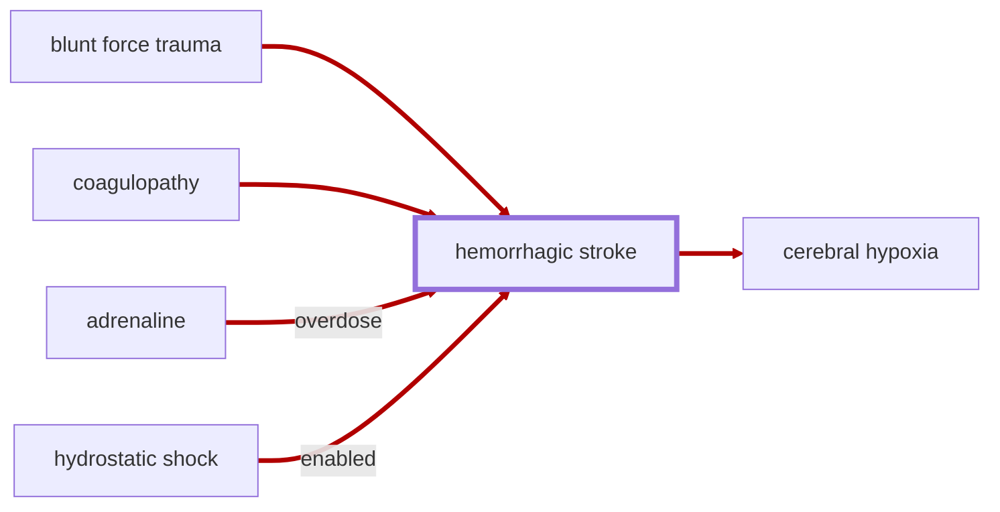

# Hemorrhagic Stroke

Status: `added, not verified`. code-synced: 2026-09-26.

<!-- @generate_breadcrumb_trail {"template": "_:file_folder: {0}_", "connector": " :arrow_right: "} -->
_:file_folder: [More Injuries User Manual](/docs/wiki/README.md) :arrow_right: [Injuries and Medical Conditions A-Z](/docs/wiki/injuries/README.md) :arrow_right: [Hemorrhagic Stroke](/docs/wiki/injuries/hemorrhagic-stroke.md)_
<!-- @end_generated_block -->

In extreme cases of head trauma, a rupture of a blood vessel in the brain may occur, causing a life-threatening condition known as a hemorrhagic stroke. Blood from the ruptured vessel leaks into the brain, causing pressure to build up and compress the surrounding tissue, starving it of oxygen and nutrients and leading to rapid loss of consciousness and death if not surgically treated.

_Basically a more severe and dangerous version of a [concussion](/docs/wiki/injuries/concussion.md#concussion)._

> **In-Game Description**
> _"**Hemorrhagic stroke** &mdash; A life-threatening condition caused by a rupture of a blood vessel in the brain. If left untreated, the patient will quickly lose consciousness as pressure builds up in the brain. As pressure accumulates, additional blood vessels may be compressed or ruptured, leading to cerebral hypoxia. Symptoms range from initial confusion and vomiting to coma, (permanent) brain damage, and death.  
> Can be temporarily stabilized to slow progression until surgery can be performed to permanently repair the rupture."_

*See the section on the [pathophysiological system](/docs/wiki/pathophysiological-system.md#pathophysiological-system) for more information on the graphical representation.*

**Causes**: Head trauma uses the same score as [concussion](/docs/wiki/injuries/concussion.md#concussion): incoming damage scaled by XML damage-type weights, hit location, and the part's hit points. The hemorrhagic stroke threshold is higher than the concussion threshold, so the same hit adds less stroke. The stroke chance is the severity added at that threshold.  
Extreme blood pressure from [adrenaline overdose](/docs/wiki/injuries/adrenaline-rush.md#adrenaline-rush) and [coagulopathy](/docs/wiki/injuries/coagulopathy.md#coagulopathy) still cause hemorrhagic stroke on their own. If simulation of [hydrostatic shock](/docs/wiki/injuries/hydrostatic-shock.md#hydrostatic-shock) is enabled in the mod settings, high-energy projectiles that cause massive temporary cavity formation and pressure waves in the tissue may also cause a hemorrhagic stroke.

**Effects**: Headache, memory loss, confusion, vomiting, rapid loss of consciousness, [cerebral hypoxia](/docs/wiki/injuries/hypoxia.md#cerebral-hypoxia), and death if not surgically treated. If the patient survives, they may suffer from permanent brain damage, including memory loss, cognitive impairment, and motor function issues.

**Treatment**: Hemorrhagic stroke can be temporarily stabilized using medicine to slow progression until surgery can be performed to permanently repair the rupture. Ultimately, surgical intervention through [trepanation](/docs/wiki/surgeries.md#trepanation), [decompressive craniectomy](/docs/wiki/surgeries.md#decompressive-craniectomy), or [stereotactic surgery](/docs/wiki/surgeries.md#stereotactic-surgery) is required to save the patient's life.

<!-- @generate_link_to_top {"template": "---\n_[back to the top]({1})_"} -->
---
_[back to the top](#hemorrhagic-stroke)_
<!-- @end_generated_block -->
