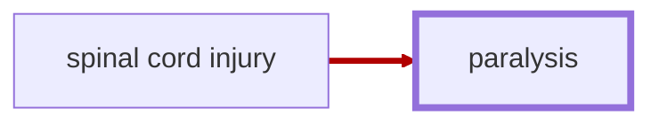

# Paralysis

Status: `implemented`. code-synced: 2026-09-26.

<!-- @generate_breadcrumb_trail {"template": "_:file_folder: {0}_", "connector": " :arrow_right: "} -->
_:file_folder: [More Injuries User Manual](/docs/wiki/README.md) :arrow_right: [Injuries and Medical Conditions A-Z](/docs/wiki/injuries/README.md) :arrow_right: [Paralysis](/docs/wiki/injuries/paralysis.md)_
<!-- @end_generated_block -->

> **In-Game Description**
> _"**Paralysis** &mdash; Damage of spinal cord caused irrepairable movement disability, ranging from sensory loss to complete loss of movement. Although there have been reports of successful experimental treatments on distant glitterworlds using cellular regenerative neurosurgery to repair damaged nerve tissue and restore function to paralyzed limbs, for most people paralysis is a life-changing condition that requires the use of bionic implants or prosthetics to restore function."_

*See the section on the [pathophysiological system](/docs/wiki/pathophysiological-system.md#pathophysiological-system) for more information on the graphical representation.*

**Causes**: Severe back injuries, such as a gunshot wound or stab wound to the spine, that crush or sever the spinal cord.

**Effects**: Damage to the spinal cord prevents the transmission of signals between the brain and the affected body parts, causing a loss of movement and sensation in the affected limbs. Depending on the severity of the injury, patients may experience a range of symptoms, from sensory loss to complete loss of movement. Negative mood effects may occur due to frustration and loss of independence associated with the condition.

**Thoughts per Stage**:
> _"**Numbness and tingling** (-2) &mdash; I can't feel parts of my body the way I used to. It's so strange... like I'm half-disconnected from myself."_  
> _"**Limited mobility** (-5) &mdash; Moving is difficult and frustrating. I feel trapped in my own body, and even simple tasks are exhausting."_  
> _"**Complete paralysis** (-10) &mdash; I can't move. My body won't respond, no matter how hard I try. I'm like a vegetable - locked inside myself. Nothing will ever be the same again."_

**Treatment**: By itself, paralysis is an irreversible condition that cannot be treated with conventional medicine. However, bionic implants or prosthetics may be used to restore partial or full function to the affected body parts. There have also been reports of successful experimental treatments on distant glitterworlds using [cellular regenerative neurosurgery](/docs/wiki/surgeries.md#cellular-regenerative-neurosurgery) to repair damaged nerve tissue and restore function to paralyzed limbs. Pawns with regeneration keep the paralysis while a spinal injury, including a scar, remains on that part. Once that injury is gone, the paralysis fades. Ordinary ghoul regeneration takes about four days from full severity. Surgery remains the cure for pawns without regeneration. This can be turned off in the mod settings when Anomaly is installed.

<!-- @generate_link_to_top {"template": "---\n_[back to the top]({1})_"} -->
---
_[back to the top](#paralysis)_
<!-- @end_generated_block -->
